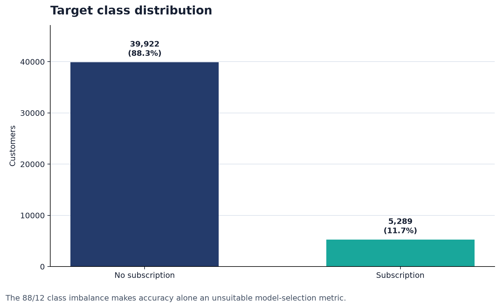
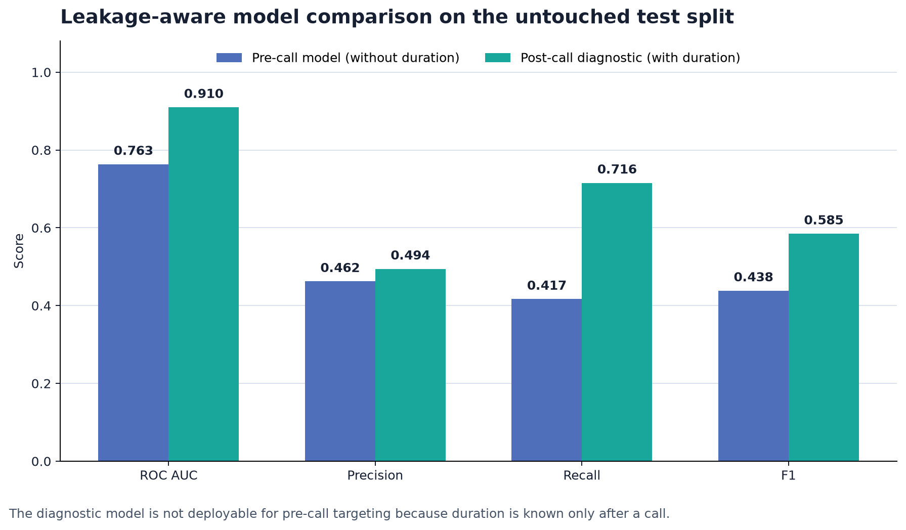
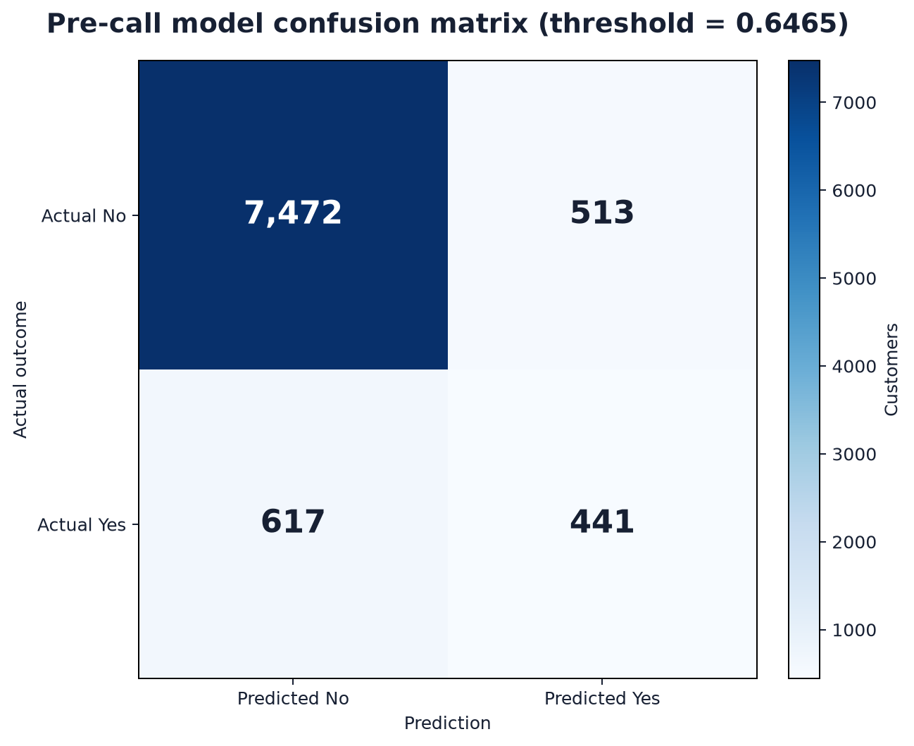
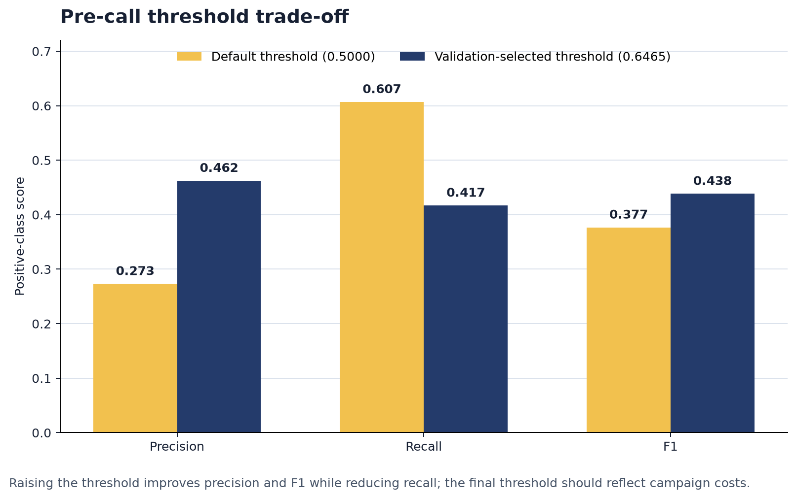

# Bank Term Deposit Predictions

A classification project for prioritizing customers who are more likely to subscribe to a bank term deposit. The repository compares modeling approaches, audits class imbalance, and translates model probabilities into a practical call-prioritization workflow.

## Business objective

Mass telemarketing is costly and can create poor customer experiences. The goal is to rank customers before a campaign so agents can focus on higher-probability leads while controlling missed opportunities and unnecessary calls.

## Dataset

The training file contains 45,211 records and 16 predictors from a direct-marketing campaign. The target is highly imbalanced.

| Target | Records | Share |
|---|---:|---:|
| No subscription | 39,922 | 88.3% |
| Subscription | 5,289 | 11.7% |

Features cover customer profile, account balance, loans, contact channel, campaign timing, contact history, and previous campaign outcome.

## Audit of the original workflow

Two issues materially affect the original presentation results:

1. Every row in `test_y.csv` also appears in `train.csv`. It is therefore not an independent external test set when the model is trained on the full `train.csv` file.
2. `duration` is the completed call duration. It is not known before the call and should be excluded from a pre-call targeting model. Including it is useful only for post-call analysis.

The legacy notebook reports 93% accuracy, 0.72 precision, 0.58 recall, and 0.64 F1 for the positive class on `test_y.csv`. Because of the 100% row overlap, those figures should not be presented as external-validation performance.

## Revised leakage-aware benchmark

I created a reproducible 60/20/20 stratified split from the 45,211-row dataset, fitted a class-weighted logistic baseline, selected the probability threshold on the validation set, and evaluated the test set once.

### Pre-call model without `duration`

| Metric | Test result |
|---|---:|
| ROC AUC | 0.763 |
| Accuracy | 0.875 |
| Precision, subscription class | 0.462 |
| Recall, subscription class | 0.417 |
| F1-score, subscription class | 0.438 |
| Selected threshold | 0.6465 |

Confusion matrix: 7,472 true negatives, 513 false positives, 617 false negatives, and 441 true positives.

### Diagnostic model with `duration`

Including completed call duration raises ROC AUC to 0.910 and F1 to 0.585, but this version cannot rank customers before agents call them. It should be labeled as a post-call diagnostic model.

## Visualizations

All figures below are generated reproducibly by `bank_term_deposit_model_audit.py` from the dataset and leakage-aware audit results.

### Target class imbalance

Only 11.7% of customers subscribed to a term deposit. This imbalance explains why accuracy alone can overstate practical model quality.



### Pre-call and post-call model comparison

The post-call diagnostic model scores higher because it includes completed call duration. That comparison is useful for diagnosis, but only the pre-call model is suitable for ranking customers before a campaign.



### Pre-call confusion matrix

At the validation-selected threshold of 0.6465, the pre-call model produces 7,472 true negatives, 513 false positives, 617 false negatives, and 441 true positives on the untouched test split.



### Decision-threshold trade-off

Moving from the default threshold to the validation-selected threshold improves positive-class precision and F1 while reducing recall. The production threshold should be chosen using campaign capacity and the relative costs of missed subscribers and unnecessary calls.



## Why SMOTE is not automatically the answer

SMOTE can help some classifiers learn the minority class, but it should be applied only inside each training fold. It must never alter validation or test data. Accuracy is also a weak selection metric for an 88/12 target because a model can achieve high accuracy by predicting mostly `No`.

For this use case, compare:

- Class weighting
- Threshold tuning on validation data
- SMOTE inside a cross-validation pipeline
- LightGBM class weights such as `scale_pos_weight`

Select the approach using positive-class recall, precision, F1, PR AUC, expected campaign value, and call-capacity constraints.

## Recommended production workflow

```text
Raw campaign data
  -> schema and leakage checks
  -> stratified or time-based split
  -> preprocessing fitted on training folds only
  -> class-weighted model / in-fold resampling
  -> validation-based threshold selection
  -> untouched test evaluation
  -> probability-ranked customer list
  -> campaign outcome monitoring and retraining
```

## Repository contents

```text
.
├── 00_ML_Project_Train_20260210.ipynb
├── 00_ML_Test_SMOTE_Normalize.ipynb
├── 01_ML_Project_Test_20260210.ipynb
├── Bank_Term_Deposit_LightGBM_Final.pkl
├── bank_term_deposit_model_audit.py
├── MODEL_AUDIT.md
├── model_audit_results.json
├── requirements.txt
├── train.csv
├── test.csv
├── test_y.csv
├── Target_Customers_Term_Deposit.csv
├── Presentation_Bank Term Deposit Predictions .pdf
├── images/
│   ├── 01_target_class_distribution.png
│   ├── 02_model_comparison.png
│   ├── 03_pre_call_confusion_matrix.png
│   └── 04_threshold_tradeoff.png
└── README.md
```

## Run the audit

```bash
pip install -r requirements.txt
python bank_term_deposit_model_audit.py
```

The legacy PyCaret notebooks require a separate environment with PyCaret and LightGBM.

## Deployment considerations

- Use only features available at scoring time.
- Choose the threshold from the cost of a call, expected deposit value, and agent capacity.
- Monitor conversion rate, calibration, subgroup performance, and feature drift.
- Do not treat model scores as guarantees or use them for credit eligibility.
- Retrain and revalidate when campaign strategy or customer behavior changes.

